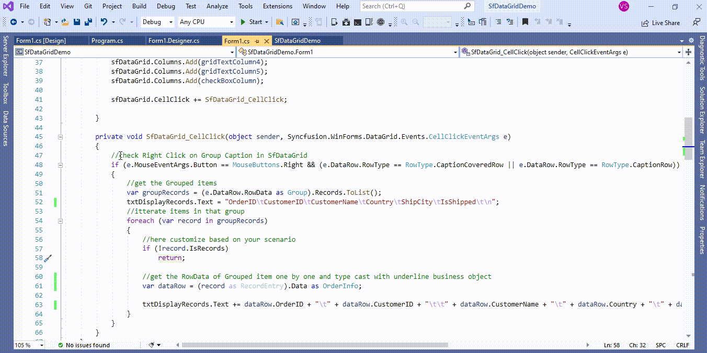

# How to get group records while right click on Group Caption in WinForms DataGrid (SfDataGrid)?

## About the sample
This example illustrates how to get group records while right click on Group Caption in [WinForms DataGrid](https://www.syncfusion.com/winforms-ui-controls/datagrid) (SfDataGrid)?

[WinForms DataGrid](https://www.syncfusion.com/winforms-ui-controls/datagrid) (SfDataGrid) does not provide the direct support to get the group records while right click on Group Caption ([CaptionSummaryRow](https://help.syncfusion.com/cr/windowsforms/Syncfusion.WinForms.DataGrid.SfDataGrid.html#Syncfusion_WinForms_DataGrid_SfDataGrid_CaptionSummaryRow)). You can get group records while right click on Group Caption ([CaptionSummaryRow](https://help.syncfusion.com/cr/windowsforms/Syncfusion.WinForms.DataGrid.SfDataGrid.html#Syncfusion_WinForms_DataGrid_SfDataGrid_CaptionSummaryRow)) by customization [CellClick](https://help.syncfusion.com/cr/windowsforms/Syncfusion.WinForms.DataGrid.SfDataGrid.html#Syncfusion_WinForms_DataGrid_SfDataGrid_CellClick) event in [WinForms DataGrid](https://www.syncfusion.com/winforms-ui-controls/datagrid) (SfDataGrid).

```C#

private void SfDataGrid_CellClick(object sender, Syncfusion.WinForms.DataGrid.Events.CellClickEventArgs e)
{
            //check Right Click on Group Caption in SfDataGrid
            if (e.MouseEventArgs.Button == MouseButtons.Right && (e.DataRow.RowType == RowType.CaptionCoveredRow || e.DataRow.RowType == RowType.CaptionRow))
            {
                //get the Grouped items
                var groupRecords = (e.DataRow.RowData as Group).Records.ToList();
                txtDisplayRecords.Text = "OrderID\tCustomerID\tCustomerName\tCountry\tShipCity\tIsShipped\t\n";
                //itterate items in that group 
                foreach (var record in groupRecords)
                {
                    //here customize based on your scenario
                    if (!record.IsRecords)
                        return;

                    //get the RowData of Grouped item one by one and type cast with underline business object
                    var dataRow = (record as RecordEntry).Data as OrderInfo;

                    txtDisplayRecords.Text += dataRow.OrderID + "\t" + dataRow.CustomerID + "\t\t" + dataRow.CustomerName + "\t" + dataRow.Country + "\t" + dataRow.ShipCity + "\t" + dataRow.IsShipped + "\t\n";
                }
            }
}  

```



Take a moment to peruse the [WinForms DataGrid - Selection](https://help.syncfusion.com/windowsforms/datagrid/selection) documentation, where you can find about selection with code examples.

## Requirements to run the demo
Visual Studio 2015 and above versions
